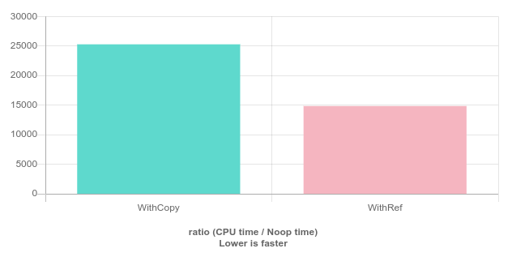

# Referências

Referências permitem criar "apelidos" para variáveis, isto é, uma referência para uma variável acessa o valor daquela variável, nomeada de outra forma. Considere o código abaixo, onde é criada uma referência de nome `b` para uma variável de nome `a`. Utiliza-se o simbolo `&` junto ao tipo da variável para declarar uma referência. Diferente de uma variável "comum", alterar o valor da referência altera o valor da variável referenciada. Portanto, no exemplo abaixo, o resultado vai ser a mensagem `a = 7, b = 7`.

```cpp
#include <iostream>

int main()
{
    int a = 1;
    int& b = a;

    b = 7;
    std::cout << "a = " << a << ", b = " << b << std::endl;

    return 0;
}
```

Como uma referência é um "apelido" para outra variável, é impossível criar uma referência para um valor. Por exemplo, `int& b = 9;` não faz sentido, e ocasiona em um erro de compilação.

É possível usar referências também na passagem de parâmetros de funções. Quando não são utilizadas referências nos parâmetros de uma função, as variáveis são copiadas para o escopo da função. Referências passadas por parâmetro e modificadas dentro do escopo de uma função alteram o valor da variável original de onde foi chamada, como mostra o exemplo abaixo.

```cpp
#include <iostream>

void wont_change_data(int a)
{
    a = 1;
}

void will_change_data(int& a)
{
    a = 1;
}

int main()
{
    int my_a = 8;
    std::cout << my_a << std::endl;

    wont_change_data(my_a);
    std::cout << my_a << std::endl;

    will_change_data(my_a);
    std::cout << my_a << std::endl;
}
```

Outro exemplo pode observado no código abaixo. Imagine que `Matrix` é uma estrutura de dados que representa uma matriz 100x100. A função `sum_elements` soma todos os elementos dessa matriz.

O loop na função `main` foi criado sintéticamente para representar muitas chamadas da função `sum_elements`. Para cada invocação da função `sum_elements`, uma instância da estrutura de dados `Matrix` é copiada para o contexto da função, apenas para somar o valor de cada um de seus elementos.

```cpp
/**
 * Soma dos elementos de uma matriz 100x100
 * :param Matrix matrix:
 * :returns double:
 */
double sum_elements(Matrix matrix)
{
    double sum = 0.;
    for (int i = 0; i < 100; ++i) {
        for (int j = 0; j < 100; ++j) {
            sum += matrix[i][j];
        }
    }
    return sum;
}

int main()
{
    // ...
    double total_sum = 0.;
    for (int i = 0; i < 1000000; ++i) {
        total_sum += sum_elements(matrix);
    }
    std::cout << "Total Sum = " << total_sum << std::endl;

    return 0;
}
```

Uma forma de evitar a cópia dessa estrutura de dados é utilizando uma referência para uma `Matrix`, ou seja, trocando a assinatura da função para `double sum_elements(Matrix& matrix)`. Apesar de resolver o problema das cópias desnecessárias, a solução mencionada não é ideal, pois passando uma referência à estrutura `Matrix`, os dados da estrutura podem ser modificados dentro do escopo da função.

Normalmente, é interessante evitar funções com esse tipo de "efeito colateral" ("side-effects"), pois a medida que o projeto cresce, isso pode gerar um problema de mantenabilidade. Para ter noção do quanto essas cópias fazem diferença nesse caso, considere a comparação abaixo, extraída a partir de benchmark feito no site [Quick Bench](https://quick-bench.com/).



Existem sim alguns programas que usam referências como parâmetros de funções e modificam seus dados. Não há problemas em fazer isso, desde que seja bem documentado ou seja óbvio ao leitor. Por exemplo, no caso acima, não é esperado que uma função de nome `sum_elements` altere os elemento da matriz, porém em uma função chamada `void sum_one_to_all_elements_in(Matrix& m)` fica mais claro que todos os elementos da matriz serão alterados.

Uma alternativa para evitar o problema comentado é o uso do modificador `const`, que faz com que a "variável" em questão seja constante, ou seja, não possa ser alterada durante a execução do programa. Antes de partir para seu uso no caso da função `sum_elements`, considere o uso de `const` em um exemplo mais simples:

```cpp
#include <iostream>

int main()
{
   double const a = 8;
   a = 9; // Erro de compilação
}
```

O código acima não irá compilar. Isso por que a variável "a" é uma constante, ou seja, não se pode alterar seu valor, como se está tentando fazer na linha 6. Casos comuns de uso de `const` são, por exemplo, as variáveis matemáticas `PI` e `e`. O modificador `const` pode também ser utilizado em conjunto com referências, criando-se referências constantes, ou seja, não é possível alterar o valor da variável referenciada.

```cpp
#include <iostream>

int main()
{
   double a = 8;
   double const& b = a;
   a = 9; // OK. `a` não é `const`. (b também assume o valor `9`)
   b = 7; // Erro de compilação: `b` é uma referência const
}
```

O código acima não irá compilar. O motivo é que não se pode alterar o valor de "a" por meio da referencia "b", pois ela é uma referência `const`. Um detalhe importante a se comentar, é que o modificador `const` se aplica sempre ao tipo à sua esquerda. Se não houver nada à esquerda, ele se aplica ao tipo à direita. Dessa forma temos:

- `double const& my_data`: Cria uma referência para um `const double`
- `const double& my_data`: Cria uma referência para um `const double` (Igual à anterior)
- `double &const my_data`: Erro de compilação, pois não faz sentido ter uma "referencia const", visto que referencias não são modificáveis

Por fim, voltando ao problema da matriz, quando escrevemos `double sum_elements(Matrix& matrix)`, evitamos que a matriz seja copiada, e isso é um ponto positivo, em termos de performance. Porém, introduzimos um possível problema: Se a matriz for modificada dentro do escopo da função `sum_elements`, então a matriz do escopo da função `main` também será modificada.

Por convenção, não esperamos que ninguém vá de fato modificar os elementos da matriz naquela função. É possível garantir isso utilizando `const&`, isto é, se alguém por engano alterar a variável matrix de dentro da função `sum_elements`, um erro de compilação ocorrerá. A assinatura da função fica da seguinte forma: `double sum_elements(Matrix const& matrix)`, e nenhuma outra modificação é necessária.
