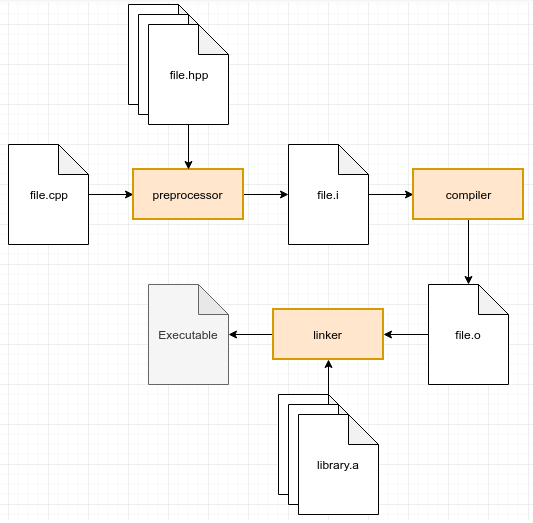

Visão geral sobre o processo de compilação
===

Conhecer o processo de compilação e linkagem do C++ é importante não apenas pelo aspecto teórico. A compreensão ajuda na
solução de problemas principalmente relacionados à gerenciamento de dependências, e o reconhecimento de problemas de
linkagem.

Apesar do processo ser possivelmente um pouco diferente entre diferentes sistemas operacionais, a noção geral é
aproximadamente a mesma. O processo tem basicamente 3 etapas: Pré-processamento, compilação e linkagem, como ilustrado
na figura abaixo. Após explicado  essas etapas, esse capítulo explica brevemente sobre o processo de carregamento e
execução de código compilado, e sobre o uso de bibliotecas externas.

