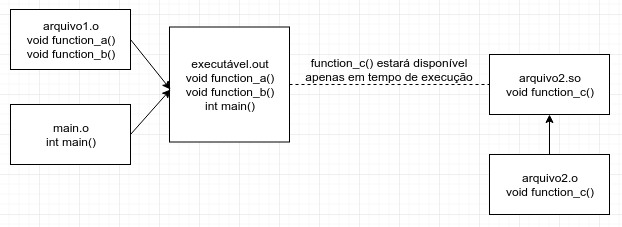

Linkagem
===

O processo final de geração do executável é a linkagem (não é um verbo real).
Neste passo, os _códigos objeto_ de todas as _unidades de tradução_ envolvidas no programa são unidos em um só.
Um arquivo executável pode ser obtido com o seguinte comando:

`g++ f.o g.o main.o`

É importante ter em mente essas etapas do processo de compilação.
Erros de compilação (sintaxe e pré-processamento) acontecerão mesmo quando você tentar compilar cada arquivo isoladamente.
Erros de linkagem (`undefined reference`, por exemplo) acontecerão apenas quando você tentar linkar os arquivos
para gerar um executável.

A linkagem comentada nessa seção é conhecida como _linkagem estática_. O código executável gerado contém todas as funções
necessárias para executa-lo, como ilustrado na imagem abaixo. Nota importante: também é usual utilizar arquivos `.a` ("Archive")
no processo de linkagem estática no Linux. Arquivos `.a` são apenas uma coleção de vários arquivos `.o`. Para gerar
arquivos `.a`, é possível utilizar o executável `ar`.

De forma alternativa, é possível organizar um projeto de software com funções separadas em
diversos arquivos executáveis. Esses arquivos, ao invés de serem linkados estáticamente, são _linkados dinamicamente_, o
que significa que as funções ficam espalhadas em diferentes arquivos, e buscadas pelo software em tempo de execução, ao
invés de serem buscadas em tempo de compilação, como no caso da _linkagem estática_.

No Linux, esses arquivos possuem extensão `.so` ("Shared Objects"), enquanto no Windows possuem extensão `.dll`
(Dynamic Linked Library). O processo de geração, linkagem e carregamento de arquivos com linkagem dinâmica é diferente
no linux e no Windows.

A ilustração abaixo traz uma visão geral do processo de consumo da função `function_c` a partir de uma linkagem
dinâmica. Nesse caso, não está sendo mostrado como o arquivo `arquivo2.so` foi gerado. No caso do Windows, o arquivo
`arquivo2.so` se chamaria `arquivo2.dll`.

As vantagens de utilizar uma biblioteca de linkagem estática incluem:

- Como todo o código está num só arquivo, atualizações de outras dependências não afetam (portanto, não quebram) o executável;
- Facilidade de instalação e compartilhamento do programa.

Enquanto algumas desvantagens são:

- O arquivo executável tende a ficar cada vez maior, pois precisa conter todas as funções em um só arquivo;
- Para atualizar um subconjunto de funções é necessário atualizar o arquivo executável inteiro.

Por outro lado, algumas vantagens da linkagem dinâmica incluem:

- Como o código está distribuído em diversos arquivos, atualizar um subconjunto de funções significa atualizar apenas alguns arquivos, ao invés de necessitar atualizar o código inteiro;
- As funções mais comuns podem ser aproveitadas e utilizadas em mais de um arquivo executável;
- Funções não utilizadas não precisam ser carregadas para a memória.

Finalmente, algumas desvantagens incluem:

- No caso de uso excessivo de bibliotecas dinâmicas, pode ser difícil de gerenciar as dependências;
- No caso de uma ou mais bibliotecas dinâmicas não estarem disponíveis, isso pode impossibilitar o uso de um executável.

Existem duas formas de consumir uma biblioteca dinâmica: Por meio de linkagem dinâmica em tempo de compilação
(_Dynamic Linking_) ou por meio de carregamento dinâmico em tempo de execução (_Dynamic Loading_). Os dois conceitos
podem ser inicialmente confusos, principalmente porque o primeiro deles possa ser confundido com o caso de linkagem
estática, mas essas formas são diferentes.

_Dynamic Linking_ faz uso de um procedimento provido pelo sistema operacional. Ao executar um programa que foi compilado
dessa forma, as bibliotecas dependentes são automaticamente carregadas no início da execução do programa. Ou seja, a
linkagem é feita em tempo de execução, mas é feita automaticamente.

Por outro lado _Dynamic Loading_ significa que o programador do executável utiliza funções auxiliares para carregar
dinâmicamente cada biblioteca que queira. Por exemplo, no Linux, é possível utilizar a função `dlopen` para carregar
um arquivo `.so`. Ou seja, a linkagem é feita em tempo de execução, mas é feita manualmente.
