# Relações

Objetos e classes podem se relacionar de diversas formas, e é importante não
confundi-las.

## Composição

A composição se dá quando um objeto possui outro objeto como campo, e é ideal
para modelar relações de "possui-um". Se a classe _Livro_ declara um campo de
classe _Capa_ e outro de classe _Contracapa_, dizemos que uma instância de
_Livro_ possui uma instância de _Capa_ e uma de _Contracapa_, ou, mais
diretamente, um _Livro_ possui uma _Capa_ e _Contracapa_.

## Herança

A herança se dá quando uma classe "herda" os campos e métodos de outra. Se a
classe _Livro_ herda da classe _Objeto_—que possui o campo _peso_—um _Livro_
também possuirá _peso_. Herança é ideal para modelar a relação "é-um-tipo-de":
_Livro_ é um tipo de _Objeto_. Nesse tipo de relação a classe herdada é chamada
de classe base, enquanto a classe que herda é chamada de classe derivada.

## Outro exemplo

Esses dois tipos de relações são fortemente suportados em C++. Utilizando-os, é
possível modelar sistemas simples ou complexos de forma orgânica e padronizada.
Aqui está um exemplo mais complexo utilizando essas relações:

- Classe _Objeto_:
  - Campos:
    - peso
- Classe _Teclado_:
  - Herda de: _Objeto_
  - Métodos:
    - Apertar
  - Campos:
    - peso (herdado de _Objeto_)
- Classe _Caixa_:
  - Herda de: _Objeto_
  - Métodos:
    - Abrir
    - Fechar
  - Campos:
    - peso (herdado de _Objeto_)

Com essas três classes, podemos modelar um caixa eletrônico:

- Classe _CaixaEletronico_:
  - Herda de: _Caixa_
  - Métodos:
    - Abrir (herdado de _Caixa_)
    - Fechar (herdado de _Caixa_)
    - Depositar
    - Sacar
  - Campos:
    - peso (herdado de _Caixa_, que herda de _Objeto_)
    - teclado (uma instância de _Teclado_)

Como um _CaixaEletronico_ é uma _Caixa_, ele pode ser aberto e fechado. _Caixa_
é um _Objeto_ que possui peso, portanto um _CaixaEletronico_ também é um
_Objeto_ com peso, mesmo que não herde de _Objeto_ diretamente. Adicionalmente,
o _CaixaEletronico_ possui dois novos métodos: _Depositar_ e _Sacar_, duas
operações que não fazem sentido em uma _Caixa_ comum.

Podemos dizer que um _CaixaEletronico_ é uma caixa (herança), e possui peso e um
teclado (composição). Lembre-se que não há a necessidade de criar novamente os
campos ou métodos herdados das classes base.
